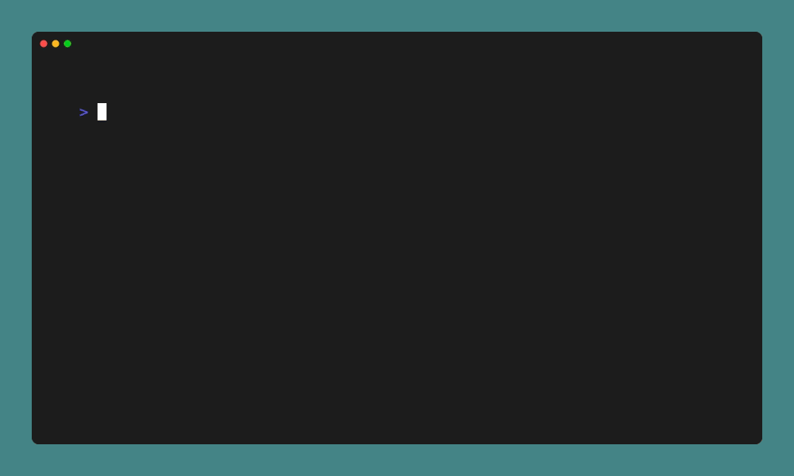

# Shitty Logging (SLog)

**Shitty Logging** (SLog) is an easy-to-use logging library for C programming language. It provides a basic logging functionality with different log levels: *INFO*, *DEBUG*, *WARNING* and *ERROR*.

## Demo



## Features

- Logging messages with different log levels.
- Customizable log output.
- Color support.

## Installation

```shell
$ git clone https://github.com/LanaMirko04/slog.git
$ cd slog
$ sudo make install
```

or

Copy files in src directory to your project

```shell
$ tree
.
├── LICENSE
├── Makefile
├── README.md
└── src
    ├── main.c
    ├── slog.c
    └── slog.h
```

## Usage
#### Console logging
```c
#include <stdio.h>
#include <slog.h>

int main(int argc, char *argv[]) {
  SLOG_INIT(NULL, true); // set to false if you don't need debug logs

  SLOG_INFO("This is an info message");
  SLOG_DEBUG("This is a debug message");
  SLOG_WARNING("This is a warning message");
  SLOG_ERROR("This is an error message");

  return 0;
}
```

#### File logging
```c
#include <stdio.h>
#include <slog.h>

int main(int argc, char *argv[]) {
  SLOG_INIT("path/to/file", true);

  SLOG_INFO("This is an info message");
  SLOG_DEBUG("This is a debug message");
  SLOG_WARNING("This is a warning message");
  SLOG_ERROR("This is an error message");

  return 0;
}
```

#### Compilation
```shell
gcc -o example example.c -lslog
```

## License
SLog is licensed under the MIT License. See the [LICENSE](LICENSE) file for more details.

## Acknowledgements
- [VHS](https://github.com/charmbracelet/vhs)
