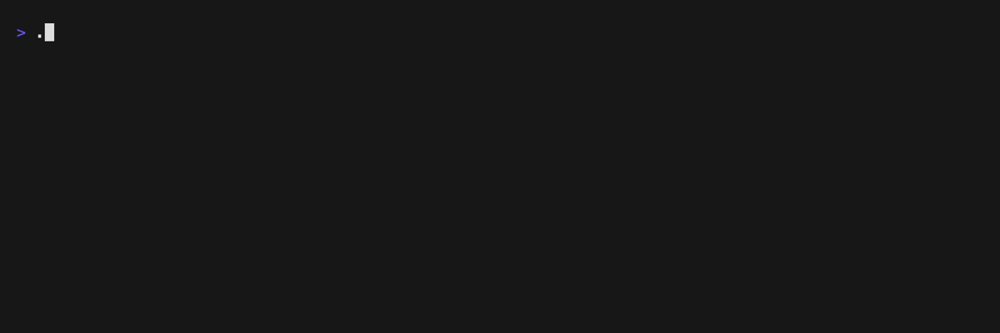

# SLog (Sh*tty Logging)

**SLog** is a minimal C logging library with color-coded output, multiple
verbosity levels, and support for logging to both stdout and a file.



## Installation
```shell
$ git clone https://github.com/LanaMirko04/slog.git
$ cd slog
$ make
$ sudo make install
```

or

Copy files in src directory to your project

```
.
├── ...
├── src
│   ├── main.c
│   ├── slog.c
│   └── slog.h
└── ...
```

## Usage
Here's a simple example of how to use `SLog` in your library:

```c
#include "slog.h"

int main(void) {
    slog_init(LV_ALL);

    slog_info("Informationl message");
    slog_error("Error message");
    slog_warn("Warning message");
    slog_debug("Debug message");

    return OK;
}
```

## API Reference
For detailed information about the API, see [API.md](./docs/API.md).

## License
SLog is licensed under the [MIT](LICENSE) License. Use at your own risk.
It’s called *SLog* for a reason.

## Acknowledgements
- [VHS](https://github.com/charmbracelet/vhs)
